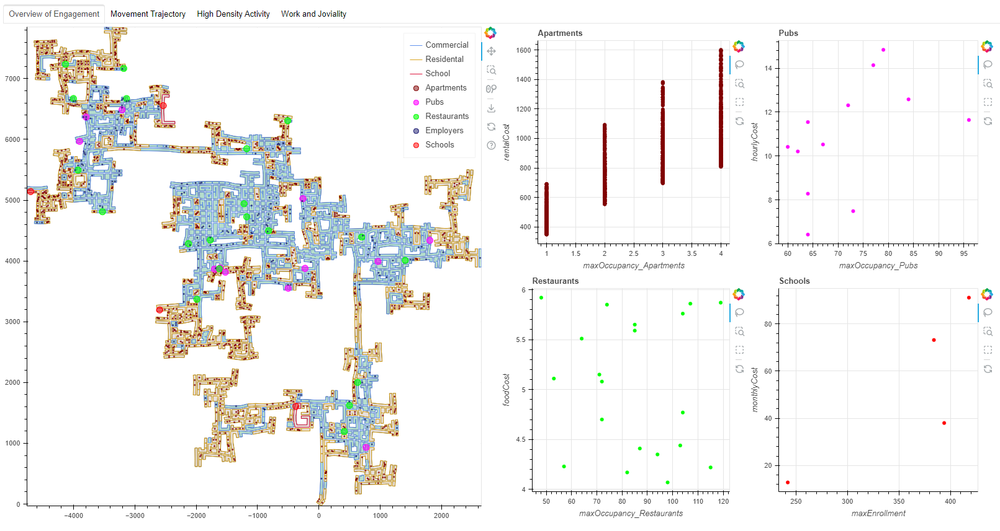
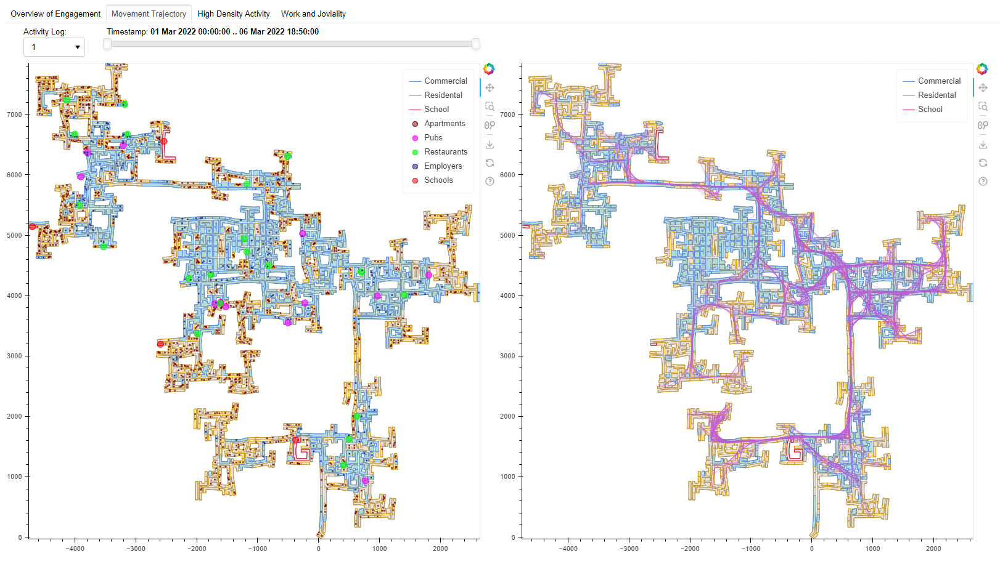
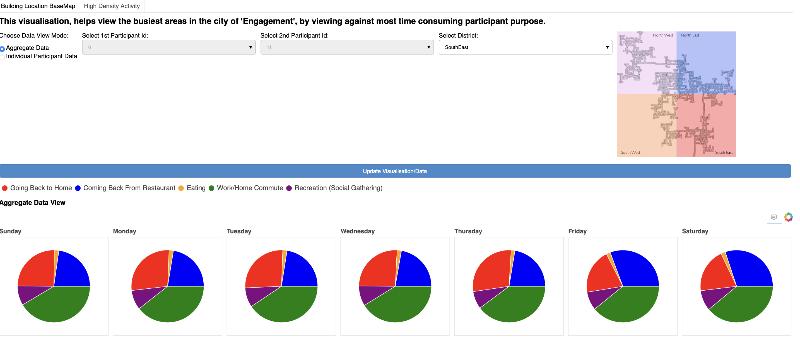
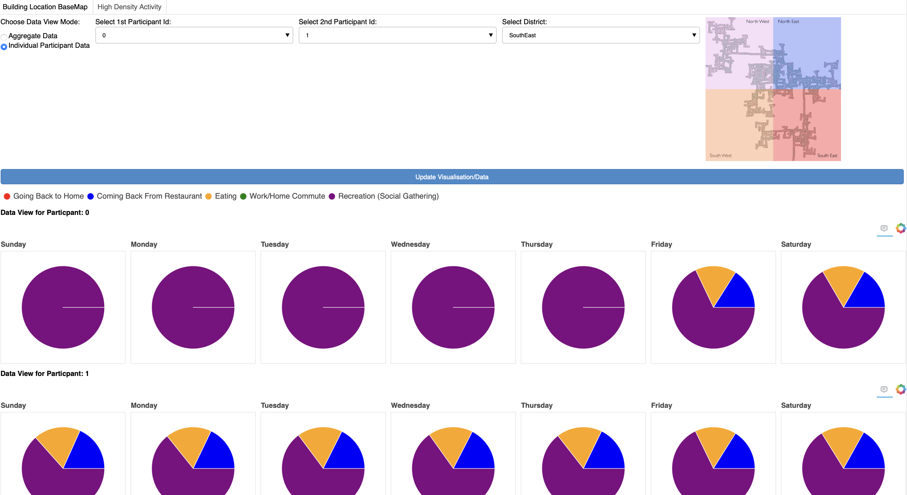

# Visual Analytics Project

University of Kaiserslautern

Winter Term 2022/23 (12 weeks)

## Contributors

- Prutha Modak
- Chandana Deshmukh
- Akhil Yeerasam

## Topic

IEEE VAST Challenge of 2022

Challenge: https://vast-challenge.github.io/2022/description.html

Data: https://seafile.rlp.net/d/881af5fb3e40479fa394/

## Approach Overview

Chosen Task - Challenge 2: Patterns of Life

Four tabs were created on Bokeh, each indicating different aspect of data. While 3 of the aspects were visualised using bokeh, the other was visualized using Dash. 

The 4 aspects are as follows:
1. Overview of the Engagement city.
    

2. Movement trajectory of the 100 participants per Activity Log.
    

3. View the busiest areas in the city of 'Engagement', against most time consuming participant activities.
    - Aggregate Data View
    
    
    - Individual Data View
    

4: Work and Joviality pattern as part of participant's daily routine

- The graph is interactive, Box selection on Fig1 updates Fig2. Age group selection on legend in Fig3 updates Fig1 and Fig2 accordingly

## Findings

1. Some data on some days are missing.
2. On an average people of all age groups work for 2500 - 2750 hours
3. Data consisted of more participants in the age group 26-45 who are working

## Install Instructions
1. Create new conda environment : conda create -n vaproject_vast22
2. Install requirements.txt : pip install -r requirements.txt

## Run Instructions
1. To run bokeh server : bokeh serve --show vast22_2 --session-token-expiration=900000
2. To run bokeh server : bokeh serve --show ./vast22_2/ --allow-websocket-origin=localhost:5006 
3. Run Dash: a. cd vast22_2  b. python dash_app.py
